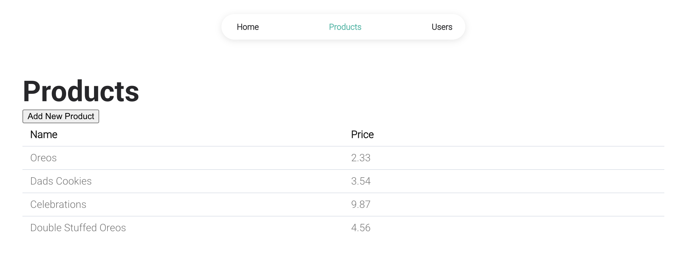
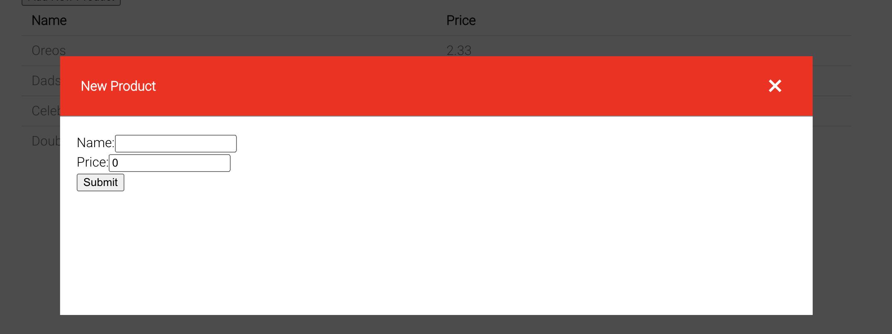
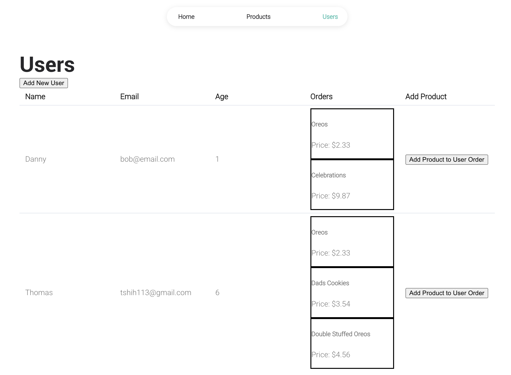
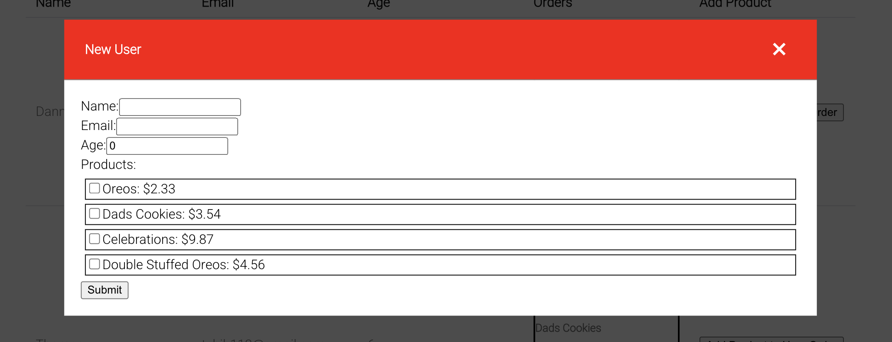
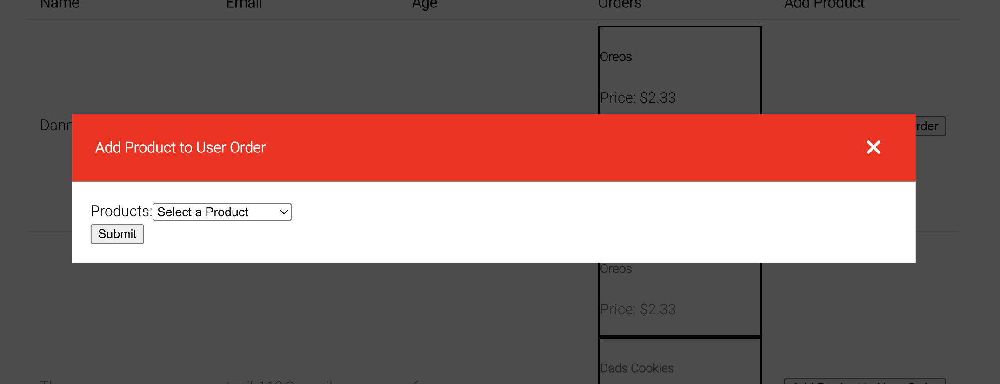
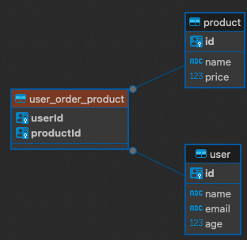

## Overview:

Simply `docker-compose up`

### [GraphQL schema ](./backend/schema.gql)

## Design justifications:
### Infrastructure
- Docker was used instead of a simple script file such that all three (fe, be, data) can be booted up with just a `docker compose up`.

### Backend/Database
- I decided that it makes sense such that multiple users can order the same product on a web page, that it should be a many-to-many relationship, (i.e. use an associations table).
    - If this is to be designed further, we would likely create a product version and such an associations table would work through a `product - product version - invoice - user` relationship.
- Instead of using in-memory SQLite, I decided to use a docker image of Postgres for the following reasons:
    - I cannot connect to an in-memory SQLite to verify the relationship structure.
    - A docker image of Postgres would also mean persistent data across various instances of code.

### Frontend
- The FE might feel adapted, this was because I took some code from a prior project.
- Instead of a `barebones UI with two input fields: “User” and “Product name” and a Button`...
    - I decided to have two pages, one to display Products, and one to display Products.
    - Product display that has a button to create a new product, which leads to a form.

## Improvements for a production app:
### Infrastructure
- Environment variables should be properly set and not hard-coded.
- Clean up docker instances.
    - Backend docker file should build a production-ready version of the server instead of it's only current purpose to package up BE.
### Backend
- Unit tests should be implemented for the BE, currently it's just a barebones, "Hey does it exist".
- Full-on CRUD should be implemented.
### Frontend
- The cache invalidation for every time a new product/user is created seems very inefficient, I should use the return output from the actual mutations to change state data.
- Responsive design, actual UIUX, etc.
- Use typescript, this should help with enforcing prop types, etc.
### Database
- The production database definitely should be more, "stable". For example, it should be an RDS instance of a dev db, where local development is connected via an SSH proxy jump server.
- Alembic migrations (or a js equivalent) should be used to administer the database instead of doing the `synchronize: true` which is very dangerous in a production environment.
- While it may make sense for a UUID for users, it might make more sense to have an int ID as a primary key for products, this would make it faster and cause less overhead.

## Challenges/Suggestions 
- It felt like the documentation was immature. I could not get Typeorm's scale option to work when trying to set a max decimal place in the DB, and I had to end up using the class validators
- There was plenty of black hole documentation on nestjs graphql on the front page of Google which did not help with understanding convention/syntax/etc. 
    - I believe improvements can also be made on the official nestjs graphql starter guide on how resolvers should be set up.
- I believe that the Doug Martin Github nestjs-query documentation should be removed/updated from the assignment, it's no longer compatible with the newest versions of nestjs and is a stale repo.
- I would love to provide good, semantic, and descriptive error messages upon validation errors from the validation pipes of mutations, however I haven't been able to find documentation on how to do that.
